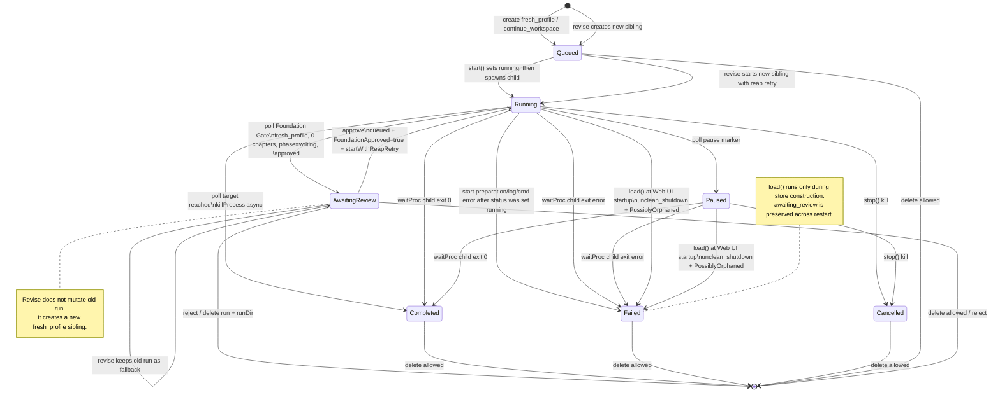

# Production Cockpit — ProdRun State Machine

> Logic reference for `prodRunRunner` + `prodRunStore` in Production Cockpit.
> Verified against current code paths:
> - `internal/entry/web/prodrun.go` — model + store
> - `internal/entry/web/prodrun_runner.go` — lifecycle + polling
> - `internal/entry/web/prodrun_handlers.go` — HTTP entry points
> - `internal/entry/web/prodrun_sync.go` — sync guards/actions
> - `internal/entry/web/prodrun_export.go` — TXT export

---

## 1. Inventory

Use cases touching `ProdRun` lifecycle:

| # | Use case | Entry point | State-changing? | Notes |
|---|---|---|---|---|
| 1 | Create `fresh_profile` | `POST /api/prodruns` | Yes | creates `queued` run |
| 2 | Create `continue_workspace` | `POST /api/prodruns` | Yes | creates `queued` run with `SeededFrom` |
| 3 | Start | `POST /api/prodruns/{id}/start` | Yes | `queued → running`; direct start has no reap retry |
| 4 | Stop | `POST /api/prodruns/{id}/stop` | Yes | `running/paused → cancelled`, unless another transition wins |
| 5 | Foundation Gate poll | runner `pollLoop` | Yes | `running → awaiting_review` for fresh profile only |
| 6 | Approve foundation | `POST /api/prodruns/{id}/approve` | Yes | `awaiting_review → queued → running`; uses reap retry |
| 7 | Reject foundation | `POST /api/prodruns/{id}/reject` | Deletes | removes run from store + runDir; no `cancelled` state |
| 8 | Revise foundation | `POST /api/prodruns/{id}/revise` | Yes | old run stays; new sibling starts |
| 9 | Delete | `DELETE /api/prodruns/{id}` | Deletes | allowed for any non-`running`/non-`paused` status |
| 10 | Unclean shutdown recovery | `prodRunStore.load()` | Yes | `running/paused → failed + PossiblyOrphaned` at Web UI startup |
| 11 | Sync | `POST /api/prodruns/{id}/sync` | No | copies files; blocks only `running/paused` |
| 12 | Export TXT | `POST /api/prodruns/{id}/export` | No | reads chapters and writes export file; no status guard |
| 13 | Read log | `GET /api/prodruns/{id}/log` | No | read-only |
| 14 | List/Get | `GET /api/prodruns`, `/{id}` | No | read-only |
| 15 | Reveal foundation dir | `POST /api/prodruns/{id}/reveal` | No | side action; loopback-only |

Shared building block: `prodRunRunner` + `prodRunStore` + `prodRunManager` own the persisted state in `output/jobs/jobs.json`. Store mutations are serialized by `prodRunStore.mu`; active child-process slot is guarded by `prodRunRunner.mu`.

---

## 2. Scope

- **Entity:** `ProdRun`
- **Persisted store:** `output/jobs/jobs.json`
- **States:** `queued`, `running`, `paused`, `awaiting_review`, `completed`, `failed`, `cancelled`
- **Terminal statuses:** `completed`, `failed`, `cancelled`
- **Deleted:** absence from store; not a status
- **Triggers:** HTTP handlers, runner `pollLoop`, `waitProc`, and store `load()` on Web UI startup

Important nuance: `delete` is not limited to terminal statuses. Current code allows deleting `queued` and `awaiting_review`; it only blocks `running` and `paused`.

---

## 3. State diagram

---

## 4. Transition table

| # | From | To | Trigger | Guard | Action | Notes |
|---|---|---|---|---|---|---|
| T1 | `[*]` | `queued` | Create `fresh_profile` | name non-empty; valid profile path | `store.create` assigns `run-NNN`, persists JSON | target defaults to 30; budget defaults to `$5` |
| T2 | `[*]` | `queued` | Create `continue_workspace` | host not running; workspace has seedable progress; `targetChapters > seed.CompletedChapters` | capture `SeededFrom`, persist queued run | actual workspace copy happens on Start, not Create |
| T3 | `queued` | `running` | Direct Start (`/start`) | status is queued; `rr.running` empty | set `Status=running`, `StartedAt`, then prepare dir and `cmd.Start()` | direct Start does **not** use `startWithReapRetry` |
| T4 | `running` | `failed` | Start preparation failure | `prepareRunDir`, log open, or `cmd.Start()` fails after T3 status update | `markFailed` | exact path is `queued → running → failed`; user observes failed |
| T5 | `running` | `awaiting_review` | Foundation Gate poll | fresh profile; status running; `chapters==0`; `!FoundationApproved`; progress phase is `writing` | set `awaiting_review`, `StopReason=foundation_ready`, `StoppedAt=now`, then `killProcess` | best-effort 5s poll; Writer may have drafted part of chapter 1 |
| T6 | `running` | `paused` | Poll sees pause marker | `hasPauseMarker(logTail)` and status running | set status paused; do not kill | false positives are possible but recoverable by Stop |
| T7 | `running` | `completed` | Poll target reached | status running; `TargetChapters > 0`; `chapters >= target` | set completed + `target_reached`, then `killProcess` | status update happens before async kill |
| T8 | `running` | `completed` | `waitProc` child exit 0 | status still running/paused | set completed + `completed` | frees active slot after `cmd.Wait()` |
| T9 | `running` | `failed` | `waitProc` child exit error | status still running/paused | set failed + `error` | if status already awaiting_review/completed/cancelled, waitProc leaves it alone |
| T10 | `running` | `cancelled` | Stop | initial status running/paused | `Process.Kill()`, set cancelled unless status became completed first | if poll completed concurrently, final status may stay completed |
| T11 | `paused` | `completed` | `waitProc` child exit 0 | status paused | set completed | same waitProc path as T8 |
| T12 | `paused` | `failed` | `waitProc` child exit error | status paused | set failed | same waitProc path as T9 |
| T13 | `paused` | `cancelled` | Stop | status paused | kill + set cancelled | |
| T14 | `awaiting_review` | `queued → running` | Approve | status awaiting_review | set queued, clear stop fields, set `FoundationApproved=true`, then `startWithReapRetry` | same run dir; existing output makes headless go through native `Resume()` (no `--prompt-file`) |
| T15 | `queued` | `awaiting_review` or `failed` | Approve start failure | `startWithReapRetry` fails | revert queued→awaiting_review **only if start() failed before the running flip** (errAnotherRunActive / not-queued); if start() already `markFailed` (prepareRunDir/cmd.Start failure after setting running), the run keeps `failed` and the revert guard is a no-op | prevents stranding the run in queued; does not overwrite a `failed` set by start() |
| T16 | `awaiting_review` | deleted | Reject | status awaiting_review | `Delete(id)` removes store entry + runDir | no `cancelled` status is written |
| T17a | `awaiting_review` | `awaiting_review` | Revise old run | status awaiting_review; feedback non-empty | no mutation to old run | old candidate remains as fallback |
| T17b | `[*]` | `queued → running` | Revise new sibling | old run valid; feedback non-empty | create new fresh_profile run with inherited config + `RevisionNote`, then `startWithReapRetry` | if start fails, new run is deleted; old remains |
| T18 | any except `running/paused` | deleted | Delete | run exists and status is not running/paused | remove store entry + runDir | includes queued, awaiting_review, completed, failed, cancelled |
| T19 | `running/paused` | `failed` | Store load on Web UI startup | persisted status running or paused | set failed + `unclean_shutdown` + `PossiblyOrphaned=true` | does not kill the real orphaned process |
| T20 | non-active | unchanged | Sync | run exists; status not running/paused; output exists | copy run output into host workspace | no status transition |
| T21 | any | unchanged | Export TXT | run exists; `chapters/*.md` exists | write `{runDir}/export/{runName}.txt` | no status guard beyond existing chapter files |

---

## 5. Non-transition operations

### Sync

`Sync` is file copy, not a state transition.

Guards/actions from code:

- Run must exist.
- Blocks only `running` and `paused`.
- Requires `{runDir}/output/novel` to exist.
- `fresh_profile`: host workspace must be empty unless `force:true`; `progress.json` is copied last.
- `continue_workspace`: requires seed metadata and compares fingerprint; if host diverged, returns conflict unless forced.

Implication: syncing `queued`, `awaiting_review`, `failed`, or `cancelled` is not blocked by status alone. It succeeds or fails based on output availability and sync guards.

### Export TXT

`ExportTXT` is also not a lifecycle transition.

- Run must exist.
- Requires `{runDir}/output/novel/chapters/*.md`.
- No status guard; a run with chapters can export even if not `completed`.

---

## 6. Gap analysis

### Important caveats

| # | Caveat | Evidence | Verdict |
|---|---|---|---|
| G1 | **Approve/Revise reap window (FIXED 2026-07-08).** Foundation Gate calls `killProcess` (async, only sends SIGKILL); `rr.running[id]` is removed only after `waitProc` returns from `cmd.Wait()`. Originally `startWithReapRetry` retried `errAnotherRunActive` for ~1s and, on exhaustion, approve reverted / revise deleted the new run — a UX caveat where a fast Approve/Revise could "not take". A second, worse window existed when approve set `queued` *before* waiting for reap: for up to 5s the run was `queued` with the old child still alive, and a concurrent `Delete` (which only blocks `running`/`paused`) could `RemoveAll` the runDir out from under the live child. **Fix**: (1) `waitProc` frees the `rr.running` slot *before* closing `proc.done`; (2) `waitReaped(id, prodRunReapTimeout=5s)` blocks on `proc.done`; (3) **Approve calls `waitReaped` BEFORE flipping status to queued**, then re-checks `awaiting_review` before setting queued+start — so the run is never `queued` while the old child lives, and a concurrent Delete/Reject during the wait is observed and aborts the approve; (4) **Revise re-fetches and revalidates the OLD run after `waitReaped`** before creating the sibling, so a reject/delete during the wait aborts without spending Architect tokens. `startWithReapRetry` kept as defense-in-depth behind `waitReaped`. | `killProcess` only sends kill; `waitProc` deletes slot then closes `proc.done`; `waitReaped` blocks on `proc.done`; `ApproveFoundation` waits before queued+rechecks; `ReviseFoundation` revalidates old after wait | **Fixed**. Tests: `TestWaitReaped*`, `TestWaitProcFreesSlotBeforeClosingDone`, `TestApproveFoundationReapTimeoutReverts`, `TestApproveFoundationDeleteDuringReapAborts`, `TestReviseFoundationWaitsForOldReap`, `TestReviseFoundationOldRejectedAborts`. |
| G2 | **Foundation Gate is best-effort.** Poll interval is 5s, while phase flip and writer dispatch happen synchronously after foundation save. | poll checks phase every 5s | Accepted design trade-off; worst case partial chapter 1 exists before review. |
| G3 | **Stop vs target-reached race gives winner-dependent final status.** If Stop wins first, final status is `cancelled`. If poll sets completed first, Stop may return conflict or kill the process while final status remains `completed`. | `stop()` checks current status; `killLocked` kills process before status update and preserves completed | Acceptable. Do not document as “child remains un-killed”; current code still kills if it has the proc. |
| G4 | **Delete allows queued/awaiting_review.** This is current backend behavior. | `Delete` only blocks running/paused | Documented behavior. If product wants stricter UI/backend policy, that is a separate code change. |
| G5 | **`load()` marks orphaned but does not kill PID.** | load sets `PossiblyOrphaned`; no process kill | Intentional orphan awareness; user must kill leftover process manually. |
| G6 | **Pause marker can false-positive.** | `hasPauseMarker` scans log text for broad markers | Known conservative detection; paused run can be stopped/exported. |
| G7 | **No `lastError` field on `ProdRun`.** | errors mostly go to returned error or stderr/log | Nice-to-have for production debugging. |

### Design integrity

- State writes are serialized through `prodRunStore.update()` / store mutex.
- Active child-process slot is serialized by `prodRunRunner.mu`.
- `start()` holds `rr.mu` through `prepareRunDir` + `cmd.Start()`; large `continue_workspace` seed copies can block another start/stop attempt during the copy.
- `waitProc` does not overwrite `awaiting_review`, `completed`, or `cancelled` after another transition has already resolved the run.

---

## 7. Test checklist

### Happy path / lifecycle

- [ ] T1: create fresh_profile → `queued`
- [ ] T2: create continue_workspace → `queued` with `SeededFrom`
- [ ] T2b: create continue_workspace with host running → 409 in handler
- [ ] T2c: create continue_workspace with `target <= CompletedChapters` → conflict
- [ ] T3: start queued → `running`, `ChildPID`, `LogPath`
- [ ] T4: start prepare/log/cmd failure → observable `failed`
- [ ] T5: Foundation Gate poll → `awaiting_review`, child killed
- [ ] T5b: continue_workspace does not trigger Foundation Gate
- [ ] T5c: approved fresh_profile does not re-trigger Foundation Gate
- [ ] T6: pause marker → `paused`
- [ ] T7: target reached → `completed`, child killed
- [ ] T8: child exit 0 → `completed`
- [ ] T9: child exit err → `failed`
- [ ] T10/T13: stop running/paused → `cancelled` unless completed wins concurrently
- [ ] T14: approve awaiting_review → resume same run dir through native Resume
- [ ] T15: approve start failure → revert to `awaiting_review`
- [ ] T15b: approve reap timeout (child not reaped in 5s) → revert to `awaiting_review`, no queued stranding
- [ ] T15c: delete/reject during approve reap wait → run stays `awaiting_review` (deleted if reject), approve aborts, no queued window with live child
- [ ] T16: reject awaiting_review → run deleted, not cancelled
- [ ] T17: revise awaiting_review → old stays, new sibling starts
- [ ] T17 fail: revise new start fails → new deleted, old unchanged
- [ ] T17b: revise reap timeout → abort, no sibling created (no Architect tokens spent)
- [ ] T17c: old run rejected/deleted before revise post-reap revalidation → revise aborts (`errDeleteRunNotFound`), no sibling/tokens spent
- [ ] T18: delete queued/awaiting_review/completed/failed/cancelled → deleted
- [ ] T18b: delete running/paused → 409
- [ ] T19: load running/paused → `failed + PossiblyOrphaned`
- [ ] T19b: load awaiting_review → preserved

### Non-transition operations

- [ ] Sync running/paused → conflict
- [ ] Sync fresh_profile into non-empty host without force → conflict
- [ ] Sync continue_workspace with matching fingerprint → fast-forward copy
- [ ] Sync continue_workspace with diverged host without force → conflict
- [ ] Export run with no chapters dir → error
- [ ] Export run with chapters → writes TXT regardless of lifecycle status

### Concurrency

- [ ] pollLoop vs waitProc both writing store → serialized by store mutex
- [ ] target-reached vs stop → no panic; final status is either completed or cancelled according to winner
- [ ] approve immediately after Foundation Gate kill → either starts after reap or reverts cleanly
- [ ] two concurrent direct starts → one active slot wins, other gets `errAnotherRunActive`
- [ ] two concurrent approve/reject → one wins; the other returns conflict/not found depending on ordering

### Persistence

- [ ] every status transition persists `jobs.json`
- [ ] restart reads store and applies unclean recovery
- [ ] corrupt `jobs.json` returns load error, no panic

---

## 8. Concurrency and I/O notes

- `start()` holds `rr.mu` from active-slot check through process registration. This keeps active-slot logic simple but means heavy `continue_workspace` seeding blocks competing start/stop calls.
- `killProcess()` only sends `Process.Kill()`. It does not remove `rr.running[id]`; `waitProc` removes the slot after `cmd.Wait()` returns.
- `waitProc` frees the `rr.running[id]` slot **before** closing `proc.done`, so the moment `proc.done` closes the single-run slot is already empty. `waitReaped(id, timeout)` blocks on `proc.done`. **Approve calls `waitReaped` before flipping to queued** (so the run is never `queued` while the old child lives — a concurrent Delete cannot RemoveAll a live-child runDir), then re-checks `awaiting_review` before set-queued+start. **Revise calls `waitReaped`, then re-fetches/revalidates the OLD run** before creating the sibling (so a reject/delete during the wait aborts without spending tokens).
- `startWithReapRetry()` is intentionally scoped to Approve/Revise after Foundation Gate kills, as defense-in-depth behind `waitReaped`. Plain `/start` does not retry.
- `waitProc` updates terminal status only when stored status is still `running` or `paused`. It leaves `awaiting_review`, `completed`, and `cancelled` alone.
- `load()` runs only during `newProdRunStore`; it is startup recovery, not a runtime transition.

---

## 9. Out of scope

| Concern | Reference / note |
|---|---|
| CSRF/auth on local state-changing endpoints | Covered only indirectly by Host allowlist / local bind assumptions |
| Symlink policy in workspace seed/sync | Needs separate filesystem-security review |
| Frontend detail-panel rerender UX | Product/UI concern, not lifecycle state machine |
| Export memory usage for very large books | `exportRunTXT` buffers output before writing |
| Profile Studio generation/review flow | `docs/journals/260705-profile-library-studio.md` |
| Foundation Gate product rationale | `docs/journals/260705-foundation-gate.md` |
| Production Cockpit overview | `docs/journals/260703-production-cockpit-mvp.md`, `docs/production-cockpit.md` |

---

## 10. Unresolved questions

- ~~Should Approve/Revise wait on `proc.done` directly instead of retrying for ~1s?~~ **Resolved 2026-07-08** — `waitReaped(id, 5s)` blocks on `proc.done`; `startWithReapRetry` kept as defense-in-depth. See G1.
- Should `ProdRun` store a `LastError` field for failed starts/runtime exits?
- Should backend intentionally block deleting `queued` runs, or is current “block only active processes” policy correct?
- Should `rr.mu` lock scope be split so heavy workspace seed copy does not block unrelated stop/start attempts?
